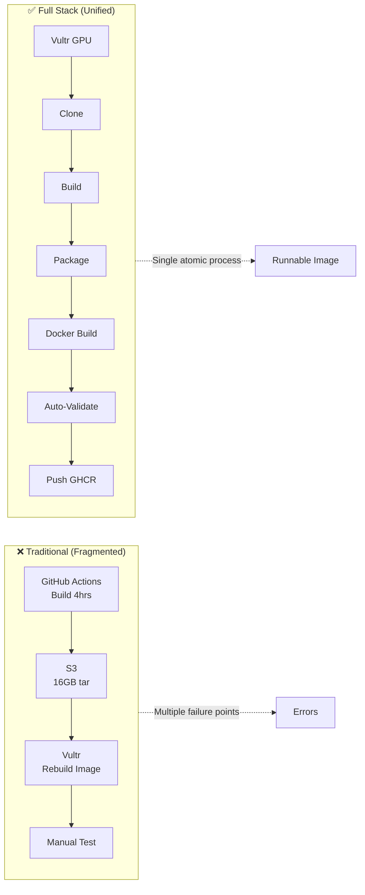
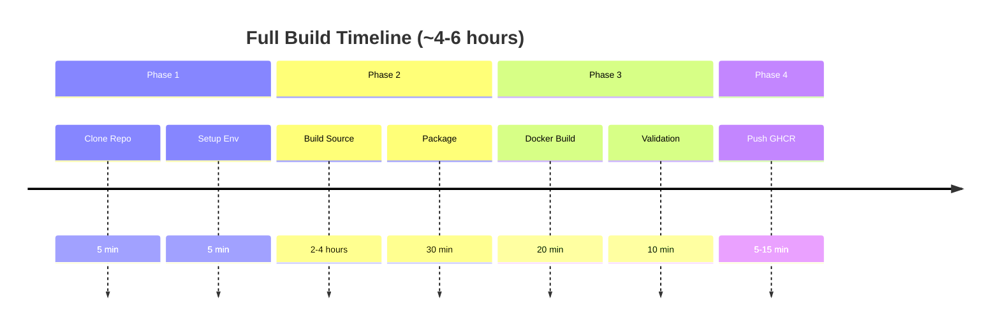
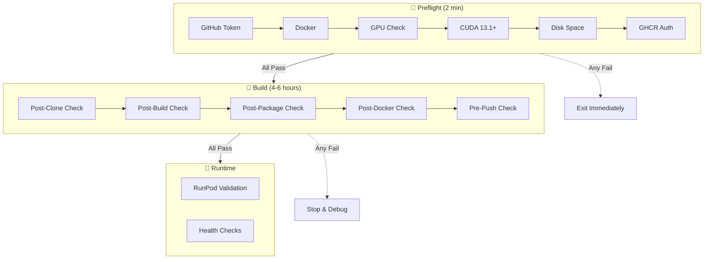
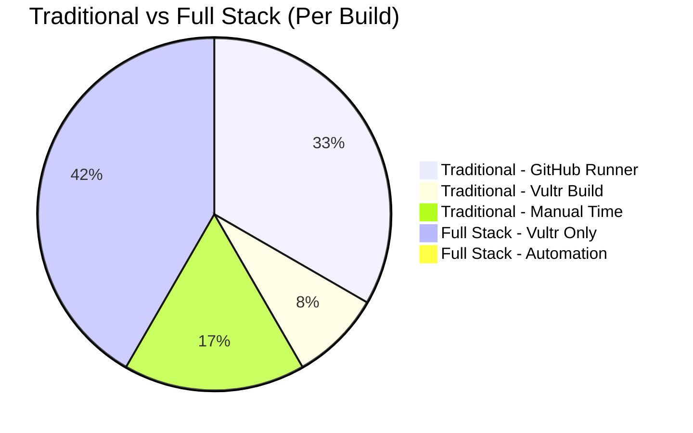

# Full Stack Build: Source → Image → Validation

## Overview

Traditional workflow had **3 separate steps**:
1. Build Isaac Sim on self-hosted runner (4+ hours)
2. Package and push to S3 (manual)
3. Build container image on Vultr (separate process)

**New unified workflow** - Single script on Vultr:
```
Source Code → Compile → Package → Containerize → Validate → Push to GHCR
     └────────────────── One Process ─────────────────────────┘
```

## Why This Approach?

| Traditional | Full Stack |
|-------------|------------|
| 3 different environments | 1 environment (Vultr) |
| Transfer 16GB tar between steps | Direct Docker build |
| S3 as intermediate storage | GHCR as final destination |
| Manual validation | Automated validation |
| Error-prone handoffs | Atomic operation |

## Process Flow



## Usage

### 1. Provision Vultr GPU Instance

Requirements:
- CUDA 13.1+ capable GPU (A100, H100, RTX Pro 6000)
- 100GB+ disk space
- Ubuntu 24.04 LTS

### 2. Run Preflight Checks (Fail Fast)

**Before starting the full build, validate your environment:**

```bash
# Download and run preflight checks
wget https://raw.githubusercontent.com/explicitcontextualunderstanding/IsaacSim/main/scripts/preflight_checks.sh
chmod +x preflight_checks.sh
export GITHUB_TOKEN=ghp_xxxxxxxx
./preflight_checks.sh
```

**What preflight checks do:**
- ✅ Verify GitHub token (`write:packages` scope)
- ✅ Check Docker daemon is running
- ✅ Validate NVIDIA GPU & drivers (570+)
- ✅ Confirm CUDA 13.1+ available
- ✅ Test Docker NVIDIA runtime
- ✅ Check disk space (100GB+ required)
- ✅ Verify memory (64GB+ recommended)
- ✅ Test network connectivity
- ✅ Validate GHCR authentication

**Why fail fast?** Catches issues in ~2 minutes instead of failing after 4 hours.

### 3. Run Full Build

**Prerequisites:**
- GitHub Personal Access Token with **`write:packages`** scope (for pushing to GHCR.io)
- All preflight checks passed

```bash
# On Vultr instance
export GITHUB_TOKEN=ghp_xxxxxxxx  # Your token here
curl -fsSL https://raw.githubusercontent.com/explicitcontextualunderstanding/IsaacSim/main/scripts/vultr_full_build.sh | bash
```

Or step-by-step:

```bash
# Download script
wget https://raw.githubusercontent.com/explicitcontextualunderstanding/IsaacSim/main/scripts/vultr_full_build.sh
chmod +x vultr_full_build.sh

# Set token (required for GHCR push)
export GITHUB_TOKEN=ghp_xxxxxxxx

# Run build
time ./vultr_full_build.sh
```

**Why the token?**
- **REQUIRED**: Push final image to `ghcr.io` (GHCR registry)
- **Optional**: Clone private repos (this repo is public)
- **Token scope needed**: `write:packages` ([create token](https://github.com/settings/tokens))

### 3. What Happens



## Validation Hierarchy (Fail Fast)



| Level | Script | When | Duration | Purpose |
|-------|--------|------|----------|---------|
| **Preflight** | `preflight_checks.sh` | Before any work | ~2 min | Fail fast on missing prerequisites |
| **Mid-Flight** | `mid_flight_check.sh` | After each phase | ~30 sec | Validate intermediate artifacts |
| **Runtime** | `runpod_validation.sh` | On RunPod | ~1 min | Confirm deployment ready |

## Build Phases

| Phase | Duration | Description | Output | Mid-Flight Check |
|-------|----------|-------------|--------|------------------|
| **1** | 10 min | Environment validation, clone repo | Source code ready | `post-clone` |
| **2** | 2-4 hrs | Compile Isaac Sim with CUDA 13.1+ | Compiled binaries | `post-build` |
| **3** | 30 min | Package release artifacts | `_build/packages/` | `post-package` |
| **4** | 20 min | Docker build with binaries | Local image | `post-docker` |
| **5** | 10 min | Container validation | Test results | `pre-push` |
| **6** | 15 min | Push to GHCR | `ghcr.io/...` | Final validation |

## Cost Comparison



| Approach | Compute Cost | Human Time | Risk |
|----------|--------------|------------|------|
| **Traditional** | $15-20 | 2-3 hours | High (handoffs) |
| **Full Stack** | $12-18 | 15 min setup | Low (atomic) |

## Validation Tests

The build automatically validates:

1. ✅ **GPU Access** - `nvidia-smi` inside container
2. ✅ **CUDA 13.1+** - `nvcc --version` check
3. ✅ **GCC 11** - Compiler version verification
4. ✅ **Vulkan** - Graphics stack available
5. ✅ **Isaac Sim Files** - All binaries present
6. ✅ **Runtime Test** - Validation script execution

## Output Artifacts

### GHCR Image
```
ghcr.io/explicitcontextualunderstanding/isaac-sim-6-full:latest
```

### Contents
- CUDA 13.1.1 runtime + devel
- Compiled Isaac Sim 6.0 binaries
- GCC 11 toolchain
- Vulkan drivers
- All dependencies

### Ready to Run
```bash
# On RunPod
docker run --gpus all -it \
  -e ACCEPT_EULA=Y \
  -e PRIVACY_CONSENT=Y \
  ghcr.io/explicitcontextualunderstanding/isaac-sim-6-full:latest
```

## Troubleshooting

### Build Fails During Compilation
```bash
# Check disk space
df -h

# Check memory
free -h

# Resume build (if incremental supported)
./vultr_full_build.sh --resume
```

### Docker Push Fails
```bash
# Verify token scope
echo $GITHUB_TOKEN | docker login ghcr.io -u explicitcontextualunderstanding --password-stdin

# Check if image exists
docker images | grep isaac-sim
```

### Validation Fails
```bash
# Inspect failing container
docker run --rm --gpus all -it isaac-sim-6:local bash

# Manual validation
cd /isaac-sim && ./scripts/validate_container.sh
```

## Migration from Traditional

### Before (S3 tar approach)
```
GitHub Actions → S3 (isaac-sim-6.tar) → Vultr (extract) → GHCR (base image)
```

### After (Full stack)
```
Vultr (build + containerize + validate) → GHCR (runnable image)
```

## Best Practices

1. **Use tmux/screen** - Build takes 4-6 hours, don't lose progress
   ```bash
   tmux new -s isaac-build
   ./vultr_full_build.sh
   # Ctrl+b d to detach
   tmux attach -t isaac-build
   ```

2. **Monitor costs** - Vultr charges by the hour
   - A100: ~$2.50/hour
   - Build time: 4-6 hours
   - **Total: ~$10-15 per build**

3. **Keep base image separate** - For faster iteration:
   - Build CUDA 13.1 base once: `isaac-sim-6-cuda13-base`
   - Layer compiled binaries: `isaac-sim-6-full`

4. **Tag versions**:
   ```bash
   docker tag isaac-sim-6:full ghcr.io/...:v6.0.0-dev2
   docker tag isaac-sim-6:full ghcr.io/...:$(date +%Y%m%d)
   ```

## Next Steps

After successful build:
1. ✅ Terminate Vultr instance (save money!)
2. ✅ Update RunPod template with new image
3. ✅ Test deployment
4. ✅ Document build hash for reproducibility

## Script Reference

| Script | Purpose |
|--------|---------|
| `vultr_full_build.sh` | **Main build script** |
| `Dockerfile.cuda13` | Base image only |
| `manual_vultr_build.sh` | Base image build (deprecated) |
| `build_cuda13_image.sh` | Local build helper |
