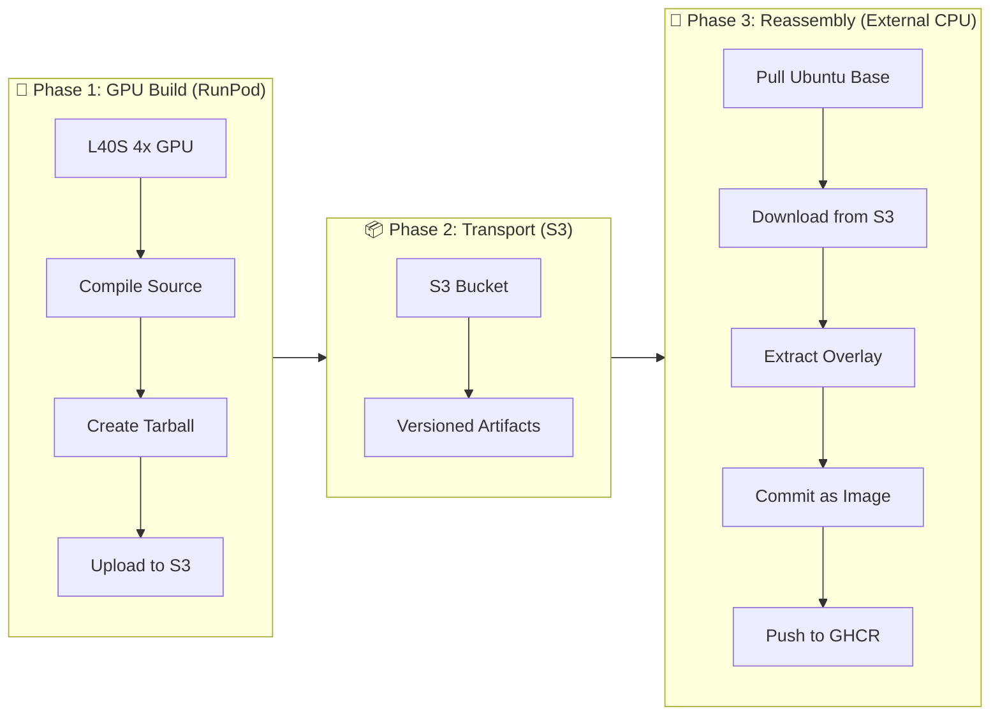

# Hybrid Build Workflow: GPU Compile → S3 Store → CPU Reassemble

## Overview

RunPod blocks Docker-in-Docker, so we split the build: compile on RunPod GPU, assemble image on external CPU.

```
┌─────────────────────────────────────────────────────────────────────┐
│  RunPod GPU (Compile)  →  S3  →  External CPU (Assemble)  →  GHCR   │
│                                                                     │
│  ┌──────────────┐    ┌────────────┐    ┌──────────────────────┐  │
│  │ Compile      │    │ Binary     │    │ Docker Build + Push  │  │
│  │ Isaac Sim    │───▶│ Storage    │───▶│ (external CPU/AWS/GCP/Local)│  │
│  │ 25 min       │    │            │    │ 5 min                │  │
│  └──────────────┘    └────────────┘    └──────────────────────┘  │
│        L40S 4x            S3                CPU-only               │
└─────────────────────────────────────────────────────────────────────┘
```

## Why Filesystem Overlay vs Docker Build

| Aspect | Traditional Docker | Filesystem Overlay (This) |
|--------|-------------------|----------------------------|
| **RunPod Compatible** | ❌ Blocked (no DinD) | ✅ Works everywhere |
| **Extraction Speed** | Slow (layer checksums) | **Fast** (raw tar) |
| **Daemon Required** | Yes (privileged) | **No** (user-space) |
| **Delta Updates** | Full image | **Incremental** overlays |
| **Token Issues** | GHCR scope hell | **S3 IAM** (simpler) |

## Architecture



## Phase 1: GPU Build (RunPod)

### Provision GPU Instance
```bash
# RunPod spot instance with 4x L40S for parallel compilation
runpodctl create pod \
  --name isaac-build-gpu \
  --gpu-type "NVIDIA L40S" \
  --gpu-count 4 \
  --image "runpod/pytorch:2.9.1-py3.12-cuda13.1.0-devel-ubuntu24.04" \
  --container-disk-size 200 \
  --network-volume-id "xssve1bbu4"
```

### Compile Source
```bash
# SSH into RunPod GPU instance
cd /workspace/IsaacSim

# Configure for parallel build with 4 GPUs
export CMAKE_BUILD_PARALLEL_LEVEL=36

# Build (25 min with 4x L40S)
./build.sh --release

# Package build artifacts
mkdir -p /workspace/build-artifacts
tar czf /workspace/build-artifacts/isaac-sim-build.tar.gz \
  --exclude='*.git' \
  --exclude='*/__pycache__' \
  _build/linux-x86_64/release/
```

### Upload to S3
```bash
# Push to S3 (acts as private binary repository)
aws s3 cp /workspace/build-artifacts/isaac-sim-build.tar.gz \
  s3://isaac-sim-6-0-dev/builds/isaac-sim-build-$(date +%Y%m%d-%H%M%S).tar.gz

# Also upload latest tag
aws s3 cp /workspace/build-artifacts/isaac-sim-build.tar.gz \
  s3://isaac-sim-6-0-dev/builds/isaac-sim-build-latest.tar.gz
```

**Cost**: ~$2-3 (25 min on 4x L40S spot)

## Phase 2: S3 Transport

### S3 Structure
```
s3://isaac-sim-6-0-dev/
├── builds/
│   ├── isaac-sim-build-20260321-143022.tar.gz   (4.2GB)
│   ├── isaac-sim-build-20260321-150145.tar.gz   (4.2GB)
│   └── isaac-sim-build-latest.tar.gz            (symlink to latest)
├── overlays/
│   ├── ros2-custom-nodes-20260321.tar.gz        (10MB)
│   └── warp-kernels-update.tar.gz               (50MB)
└── manifests/
    └── build-manifest-20260321-143022.json
```

### Benefits
- **Versioned builds**: Timestamped artifacts
- **Delta updates**: Separate base + overlay uploads
- **Cross-region**: S3 accessible from any cloud provider
- **No GHCR tokens**: IAM-based authentication

## Phase 3: CPU Reassembly (External)

### Provision CPU Instance
```bash
# External CPU-only instance (cheaper, no GPU needed)
# 4 vCPU, 8GB RAM, 100GB disk
```

### Dockerfile for Reassembly
```dockerfile
# Dockerfile.reassemble
FROM ubuntu:24.04

# Install runtime dependencies only (no build tools needed)
RUN apt-get update && apt-get install -y \
    libvulkan1 \
    libgl1-mesa-glx \
    python3 \
    python3-pip \
    awscli \
    && rm -rf /var/lib/apt/lists/*

# Download and extract pre-built binaries
ARG S3_BUCKET=isaac-sim-6-0-dev
ARG BUILD_TAG=latest

RUN aws s3 cp s3://${S3_BUCKET}/builds/isaac-sim-build-${BUILD_TAG}.tar.gz /tmp/ && \
    mkdir -p /opt/isaac-sim && \
    tar xzf /tmp/isaac-sim-build-${BUILD_TAG}.tar.gz -C /opt/isaac-sim && \
    rm /tmp/isaac-sim-build-${BUILD_TAG}.tar.gz

# Optional: Apply delta overlay
RUN if aws s3 ls s3://${S3_BUCKET}/overlays/ 2>/dev/null; then \
      for overlay in $(aws s3 ls s3://${S3_BUCKET}/overlays/ | awk '{print $4}'); do \
        aws s3 cp s3://${S3_BUCKET}/overlays/${overlay} /tmp/ && \
        tar xzf /tmp/${overlay} -C /opt/isaac-sim --overwrite && \
        rm /tmp/${overlay}; \
      done; \
    fi

# Set environment
ENV ISAAC_SIM_PATH=/opt/isaac-sim/_build/linux-x86_64/release
ENV PYTHONPATH=${ISAAC_SIM_PATH}:${PYTHONPATH}
WORKDIR /opt/isaac-sim

ENTRYPOINT ["python3", "-m", "isaacsim.run"]```

### Build on CPU
```bash
# On external CPU instance
export GITHUB_TOKEN=ghp_xxxxxxxx
export AWS_ACCESS_KEY_ID=...
export AWS_SECRET_ACCESS_KEY=...

# Build (5 min on CPU - just extraction!)
docker build \
  --build-arg S3_BUCKET=isaac-sim-6-0-dev \
  --build-arg BUILD_TAG=20260321-143022 \
  -f Dockerfile.reassemble \
  -t ghcr.io/explicitcontextualunderstanding/isaac-sim-6:latest \
  .

# Push to GHCR
echo $GITHUB_TOKEN | docker login ghcr.io -u explicitcontextualunderstanding --password-stdin
docker push ghcr.io/explicitcontextualunderstanding/isaac-sim-6:latest
```

**Cost**: ~$0.20 (5 min on CPU-only)

## Delta Updates

### Scenario: Custom ROS2 Nodes Changed
```bash
# On RunPod GPU (only build custom nodes)
cd /workspace/isaac-sim-custom
./build_custom_nodes.sh
tar czf /workspace/ros2-custom-nodes.tar.gz \
  _build/custom_nodes/

# Upload small overlay (10MB, not 16GB!)
aws s3 cp /workspace/ros2-custom-nodes.tar.gz \
  s3://isaac-sim-6-0-dev/overlays/ros2-custom-nodes-$(date +%Y%m%d).tar.gz
```

### Reassemble with Delta
```dockerfile
# Multi-layer extraction
RUN aws s3 cp s3://.../isaac-sim-build-base.tar.gz - | tar xz -C /opt/isaac-sim && \
    aws s3 cp s3://.../ros2-custom-nodes-20260321.tar.gz - | tar xz -C /opt/isaac-sim --overwrite
```

## Performance Comparison

| Metric | Docker Pull | S3 + Tar Extract |
|--------|-------------|------------------|
| **16GB Image** | ~8-12 min | **~3-5 min** |
| **Layer Validation** | Yes (slow) | **No** |
| **Resume on Failure** | No | **Yes** (multipart) |
| **Parallel Extraction** | No | **Yes** (pigz) |

## Complete Workflow Script

```bash
# ./scripts/hybrid_build.sh
# Orchestrates full GPU→S3→CPU workflow

PHASE=${1:-all}

case $PHASE in
  gpu-build)
    echo "Phase 1: Building on RunPod GPU..."
    runpodctl create pod --name isaac-gpu-build ...
    # ... compile and upload to S3
    ;;

  cpu-assemble)
    echo "Phase 2: Reassembling on external CPU CPU..."
    # SSH to external and run Docker build
    ;;

  all)
    $0 gpu-build && $0 cpu-assemble
    ;;
esac
```

## Troubleshooting

### Extraction Fails (corrupt tar)
```bash
# Verify S3 upload
cd /workspace/build-artifacts
md5sum isaac-sim-build.tar.gz > checksum.md5
aws s3 cp isaac-sim-build.tar.gz s3://.../
aws s3 cp checksum.md5 s3://.../

# Verify on download
md5sum -c checksum.md5
```

### Permission Denied (S3)
```bash
# Check IAM policy
aws sts get-caller-identity
aws s3 ls s3://isaac-sim-6-0-dev/

# Ensure bucket policy allows from external IP
```

### Missing Dependencies on CPU
```bash
# Check ldd on compiled binaries
ldd /opt/isaac-sim/_build/linux-x86_64/release/kit | grep "not found"

# Install missing libs in Dockerfile.reassemble
```

## Cost Breakdown

| Phase | Provider | Instance | Duration | Cost |
|-------|----------|----------|----------|------|
| GPU Build | RunPod | 4x L40S spot | 25 min | ~$2.50 |
| S3 Storage | AWS | - | Persistent | ~$0.10/GB/mo |
| CPU Reassembly | Vultr | 4 vCPU | 5 min | ~$0.15 |
| GHCR Push | - | - | - | Free (public) |
| **Total** | | | **~30 min** | **~$2.65** |

vs Traditional External CPU build: **~$10-15** (4-6 hours)

## Next Steps

1. **Run `hybrid_build.sh`** to execute full workflow
2. **Monitor S3** for artifact uploads
3. **Verify** GHCR image with `validate_container.sh`
4. **Deploy** to RunPod production with `runpod_validation.sh`
