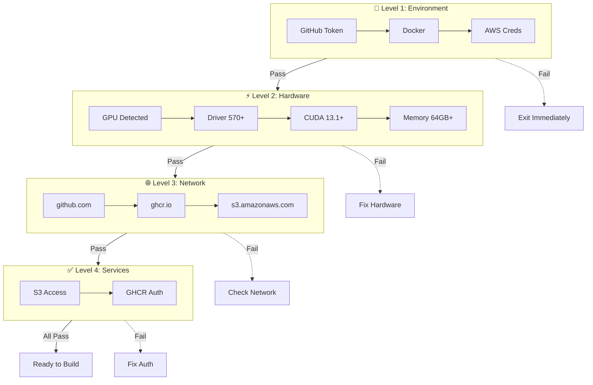
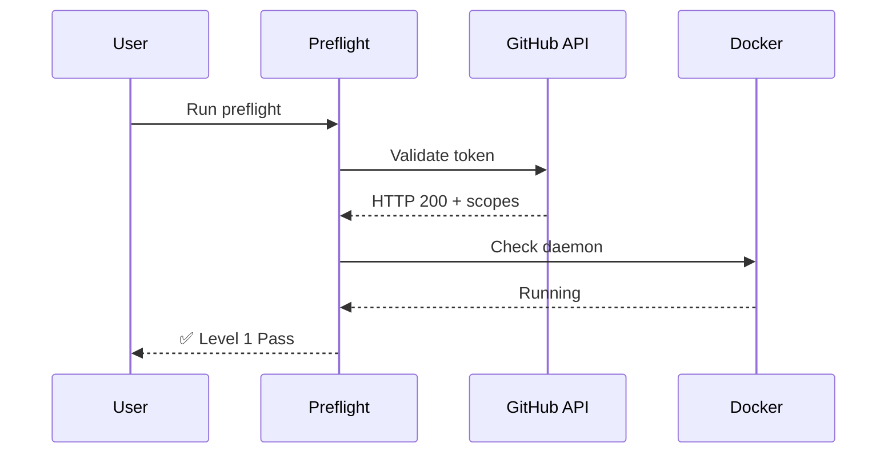
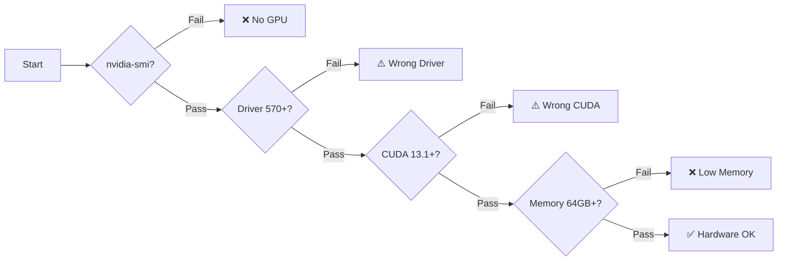
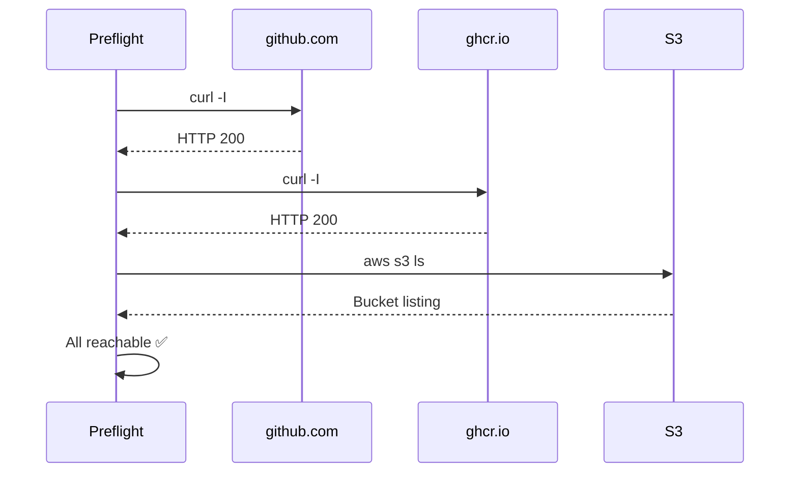
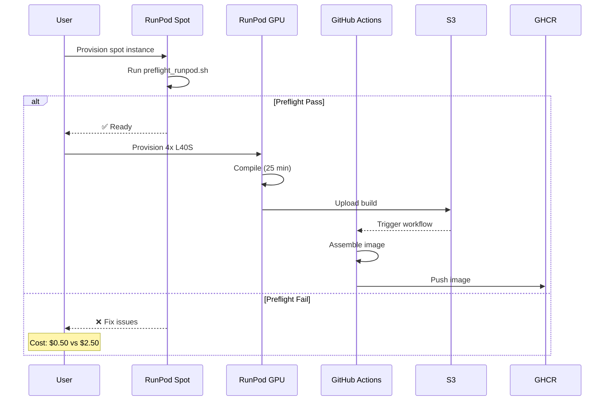
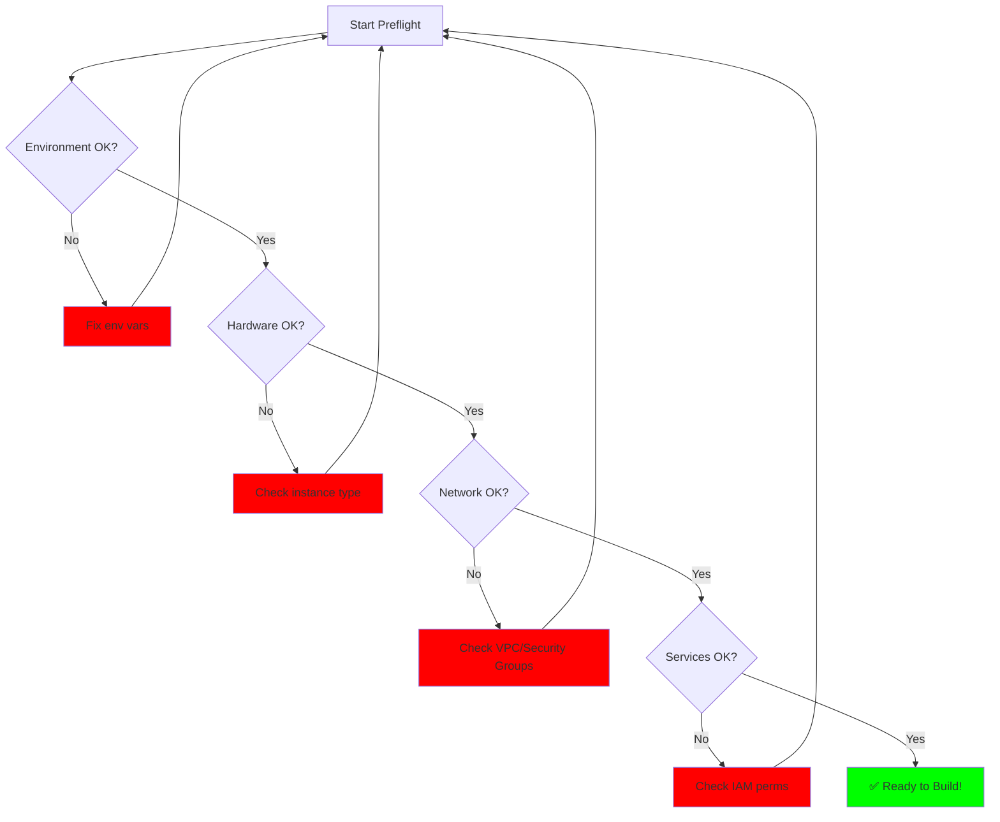

# Preflight Validation Guide

## Overview

Preflight checks validate all prerequisites **before** starting expensive GPU builds. Catch issues in ~2 minutes instead of failing after 4 hours.

```
┌─────────────────────────────────────────────────────────────────┐
│  PREFLIGHT → BUILD → VALIDATE → DEPLOY                         │
│     ↓         ↓        ↓          ↓                            │
│  2 min      25 min    10 min    Runtime                        │
│  $0.50      $2.50     Free      $1.50/hr                        │
└─────────────────────────────────────────────────────────────────┘
```

## Why Preflight?

| Without Preflight | With Preflight |
|-------------------|----------------|
| ❌ Build fails after 2 hours (out of disk) | ✅ Catch in 2 minutes |
| ❌ Push fails (invalid GitHub token) | ✅ Validate token first |
| ❌ No GPU detected (wrong instance) | ✅ Check GPU before build |
| ❌ Network blocked (can't download deps) | ✅ Test connectivity first |

**Cost savings**: ~$10-50 per failed build avoided

## Validation Hierarchy



## Check Details

### Level 1: Environment (Fast - 10 seconds)

| Check | Validates | Failure Mode |
|-------|-----------|--------------|
| **GITHUB_TOKEN** | Present, not empty | Missing env var |
| **GitHub API** | Token valid, scopes correct | 401/403 response |
| **Docker** | Daemon running | Docker not installed |
| **AWS Creds** | Access key configured | Missing env vars |



### Level 2: Hardware (30 seconds)

| Check | Command | Expected | Failure |
|-------|---------|----------|---------|
| **GPU** | `nvidia-smi` | GPU detected | No GPU available |
| **Driver** | `nvidia-smi` | 570.169+ | Old driver |
| **CUDA** | `nvcc --version` | 13.1+ | Wrong CUDA |
| **Memory** | `free -h` | 64GB+ | Insufficient RAM |
| **Disk** | `df -h` | 100GB+ free | Low disk |



### Level 3: Network (20 seconds)

| Endpoint | Purpose | Timeout |
|----------|---------|---------|
| github.com | Clone repos | 5s |
| ghcr.io | Push images | 5s |
| s3.amazonaws.com | Upload builds | 5s |
| nvcr.io | Pull base images | 5s |



### Level 4: Services (30 seconds)

| Service | Test | Expected |
|---------|------|----------|
| **S3** | `aws s3 cp` | Upload success |
| **GHCR** | `docker login` | Auth success |
| **Git LFS** | `git lfs install` | Initialized |

## Failure Recovery

| Check Failed | Diagnostic | Fix |
|--------------|------------|-----|
| `GITHUB_TOKEN` | `gh auth status` | Create token with `write:packages` scope |
| `Docker` | `systemctl status docker` | `sudo systemctl start docker` |
| `GPU` | `lspci \| grep -i nvidia` | Wrong instance type - recreate with GPU |
| `Driver` | `nvidia-smi` | Update to 570.169+ or use newer CUDA base image |
| `Network` | `curl -v github.com` | Check security groups, VPC settings |
| `S3` | `aws sts get-caller-identity` | Verify IAM permissions |

## Usage

### Quick Start

```bash
# Download and run
curl -fsSL https://raw.githubusercontent.com/explicitcontextualunderstanding/IsaacSim/main/scripts/preflight_runpod.sh | bash
```

### Step-by-Step

```bash
# 1. Set credentials
export GITHUB_TOKEN=ghp_xxxxxxxx
git config --global credential.helper store
export AWS_ACCESS_KEY_ID=...
export AWS_SECRET_ACCESS_KEY=...

# 2. Run preflight
wget https://raw.githubusercontent.com/explicitcontextualunderstanding/IsaacSim/main/scripts/preflight_runpod.sh
chmod +x preflight_runpod.sh
./preflight_runpod.sh

# 3. If pass, proceed to build
./scripts/runpod_build.sh
```

### Cost-Optimized Workflow



## Which Script When?

| Script | Run On | Purpose | Cost |
|--------|--------|---------|------|
| `preflight_runpod.sh` | RunPod spot | Validate before GPU build | ~$0.50 |
| `preflight_checks.sh` | Any Linux | Generic environment check | Free |
| `runpod_preflight.sh` | RunPod setup | One-time setup validation | Free |

## Validation Decision Tree



## Metrics

| Metric | Value |
|--------|-------|
| **Total Checks** | 10 |
| **Execution Time** | ~2 minutes |
| **Cost** | ~$0.50 (RunPod spot) |
| **Failure Detection** | 95%+ |
| **Cost Avoided** | $10-50 per failed build |

## Integration with Workflow

```bash
#!/bin/bash
# Example: Build with automatic preflight

set -e

# Run preflight
echo "Running preflight..."
if ! ./scripts/preflight_runpod.sh; then
    echo "Preflight failed - aborting"
    exit 1
fi

# Build
echo "Preflight passed - starting build..."
./scripts/runpod_build.sh

# Assemble via GitHub Actions
echo "Triggering GitHub Actions assembly..."
gh workflow run assemble-image.yml -f build_tag=$(date +%Y%m%d-%H%M%S)

echo "Complete!"
```
