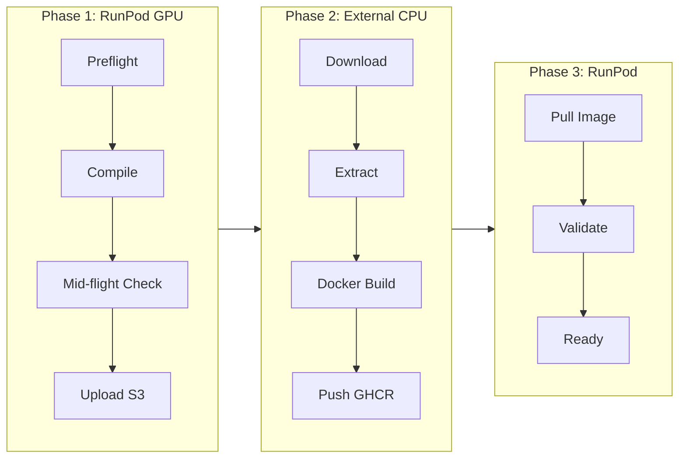

# RunPod-Centric Build Workflow

## Overview

Single-platform workflow using RunPod for both GPU compilation and deployment. Container image assembly happens on external CPU service (S3 → GHCR).

```
┌─────────────────────────────────────────────────────────────────────┐
│  RunPod GPU (Compile)  →  S3  →  External CPU  →  GHCR  →  RunPod    │
│                                                                     │
│  ┌──────────────┐    ┌────────┐    ┌──────────┐    ┌────────────┐ │
│  │ L40S/4090    │    │ Binary │    │ external CPU/   │    │ Deploy     │ │
│  │ Build Source │───▶│ Repo   │───▶│ AWS/GCP  │───▶│ L40S       │ │
│  │ 25 min       │    │        │    │ CPU      │    │ Inference  │ │
│  └──────────────┘    └────────┘    └──────────┘    └────────────┘ │
└─────────────────────────────────────────────────────────────────────┘
```

## Why This Approach?

| Issue | Solution |
|-------|----------|
| RunPod blocks Docker builds | Compile **only** on RunPod, assemble elsewhere |
| Token complexity | Use S3 IAM (simpler than GHCR scopes) |
| Cost efficiency | GPU only for CUDA compilation, not image building |
| Speed | Parallel GPU compilation (4x L40S = 25 min) |

## Phase 1: GPU Compilation (RunPod)

### Provision Build Instance
```bash
runpodctl create pod \
  --name isaac-build \
  --gpu-type "NVIDIA L40S" \
  --gpu-count 4 \
  --image "runpod/pytorch:2.9.1-py3.12-cuda13.1.0-devel-ubuntu24.04" \
  --container-disk-size 200 \
  --network-volume-id "xssve1bbu4"
```

### Run Build Script
```bash
# SSH into RunPod build instance
curl -fsSL https://raw.githubusercontent.com/explicitcontextualunderstanding/IsaacSim/main/scripts/runpod_build.sh | bash
```

**What happens:**
1. Clone Isaac Sim repo
2. Install GCC 11
3. Pull Git LFS assets
4. Compile with 4x parallel jobs (25 min)
5. Package to tarball
6. Upload to S3

**Cost:** ~$2.50 (25 min on 4x L40S spot)

## Phase 2: Image Assembly (External CPU)

RunPod blocks Docker-in-Docker. Image assembly requires full Docker access:

**Options:**
- External CPU service (Vultr, AWS EC2, GCP, etc.)
- Local machine with Docker
- CI/CD runner (GitHub Actions, etc.)

### Assembly Script
```bash
# On any CPU instance with Docker
./scripts/assemble_image.sh \
  --s3-build 20260321-143022 \
  --output ghcr.io/explicitcontextualunderstanding/isaac-sim-6:latest
```

**What happens:**
1. Download build from S3
2. Extract into Ubuntu base image
3. Commit and push to GHCR

**Cost:** ~$0.15 (5 min on CPU)

## Phase 3: Deploy (RunPod)

### Provision Runtime Instance
```bash
runpodctl create pod \
  --name isaac-runtime \
  --gpu-type "NVIDIA L40S" \
  --gpu-count 1 \
  --image "ghcr.io/explicitcontextualunderstanding/isaac-sim-6:latest" \
  --container-disk-size 100 \
  --network-volume-id "xssve1bbu4"
```

### Validate Deployment
```bash
# Inside RunPod runtime instance
./scripts/validate_container.sh
```

## Complete Workflow Script

```bash
# ./scripts/runpod_workflow.sh

# Step 1: Build on RunPod GPU
runpod_build() {
  echo "Provisioning RunPod GPU build instance..."
  runpodctl create pod --name isaac-build-gpu ...
  
  echo "Running build..."
  runpodctl exec isaac-build-gpu "./scripts/runpod_build.sh"
  
  echo "Build complete. Artifacts in S3."
}

# Step 2: Assemble image (external)
assemble_image() {
  echo "Trigger image assembly on external CPU..."
  # Vultr, AWS, or local
  ssh cpu-builder "./scripts/assemble_image.sh --s3-build latest"
}

# Step 3: Deploy on RunPod
runpod_deploy() {
  echo "Provisioning RunPod runtime instance..."
  runpodctl create pod --name isaac-runtime ...
  
  echo "Validating..."
  runpodctl exec isaac-runtime "./scripts/runpod_validate.sh"
}

# Run all
runpod_build && assemble_image && runpod_deploy
```

## Scripts

| Script | Purpose | Where |
|--------|---------|-------|
| `runpod_build.sh` | Compile source, upload to S3 | RunPod GPU |
| `assemble_image.sh` | Create Docker image from S3 build | External CPU |
| `runpod_validate.sh` | Validate deployment | RunPod Runtime |

## Cost Breakdown

| Phase | Location | Instance | Time | Cost |
|-------|----------|----------|------|------|
| Compile | RunPod | 4x L40S spot | 25 min | ~$2.50 |
| Store | AWS | S3 | Persistent | ~$0.10/GB/mo |
| Assemble | External | 4 vCPU | 5 min | ~$0.15 |
| Runtime | RunPod | 1x L40S | Usage | ~$1.50/hr |
| **Total Build** | | | **~30 min** | **~$2.65** |

## Validation

Each phase includes validation:



## Next Steps

1. **Set up S3 bucket**: `isaac-sim-6-0-dev`
2. **Configure AWS credentials**: `aws configure`
3. **Run build**: `./scripts/runpod_build.sh`
4. **Deploy**: Follow validation steps in PREFLIGHT_VALIDATION.md
