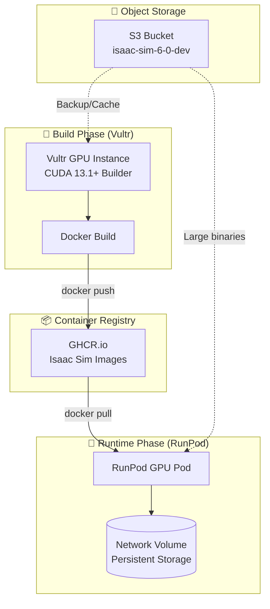
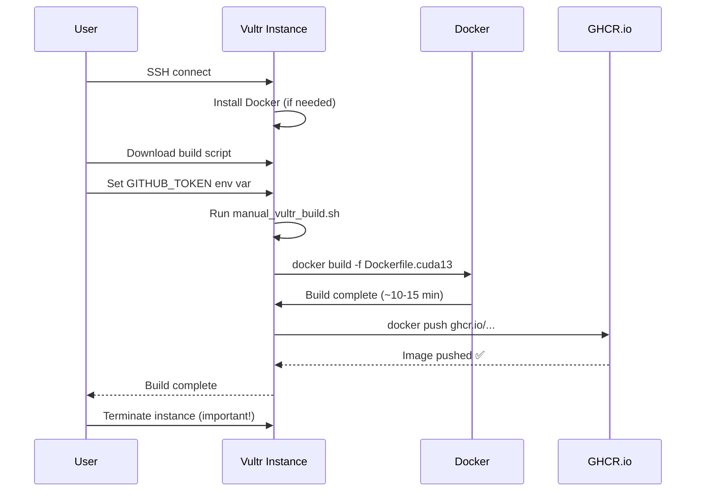
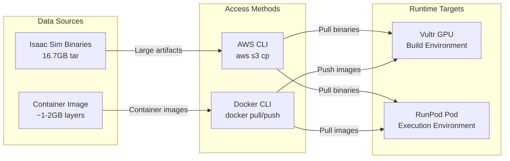
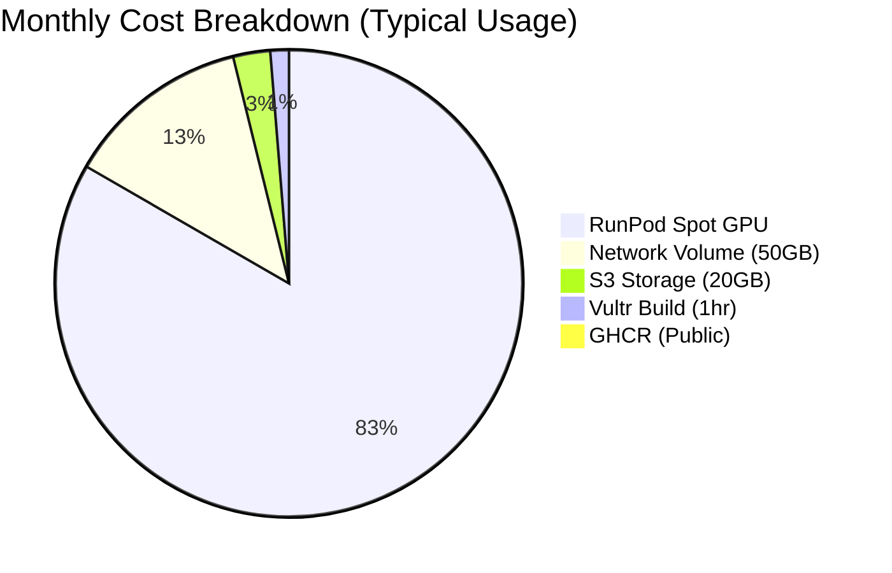
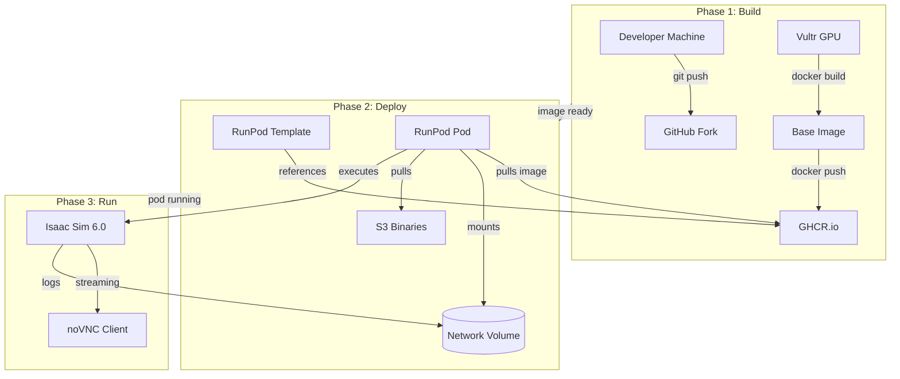
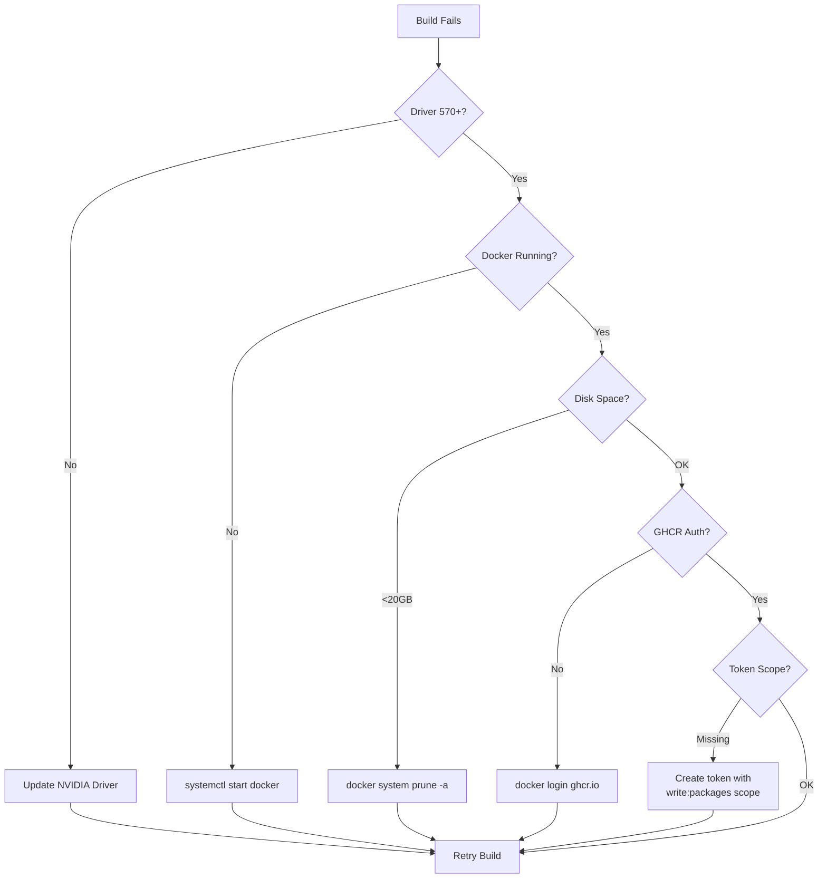

# Vultr Build Guide (LEGACY) - Use Hybrid Workflow Instead

> ⚠️ **DEPRECATED**: This guide is for **legacy full builds on Vultr only** (~$10-15, 4-6 hours).
>
> **RECOMMENDED**: Use [Hybrid GPU→S3→CPU Workflow](HYBRID_BUILD_WORKFLOW.md) instead (~$2.65, 30 min).
>
> This document is kept for reference. For new builds, use hybrid approach.

## Quick Decision

| Scenario | Use This | Cost | Time |
|----------|----------|------|------|
| **New Build** | [Hybrid Workflow](HYBRID_BUILD_WORKFLOW.md) | ~$2.65 | 30 min |
| **Emergency/Debug** | This guide (full Vultr) | ~$10-15 | 4-6 hours |
| **CPU Reassembly Only** | Hybrid Phase 3 | ~$0.20 | 5 min |

## Legacy Architecture (Full Vultr Build)



## Prerequisites
- Vultr GPU instance with Docker access
- GitHub Personal Access Token with `write:packages` scope
- CUDA 13.1+ capable GPU (RTX Pro 6000, RTX 5090, H100, etc.)

## Quick Start

### 1. SSH into your Vultr instance
```bash
ssh root@<your-vultr-ip>
```

### 2. Download and run the build script

**Prerequisites:** GitHub token with `write:packages` scope ([create token](https://github.com/settings/tokens))



```bash
# Set your GitHub token (for GHCR push)
export GITHUB_TOKEN=ghp_xxxxxxxx

# Run build
curl -fsSL https://raw.githubusercontent.com/explicitcontextualunderstanding/IsaacSim/main/scripts/manual_vultr_build.sh | bash
```

Or manually:
```bash
# Copy the Dockerfile.cuda13 from this repo
# Copy scripts/manual_vultr_build.sh
chmod +x manual_vultr_build.sh
export GITHUB_TOKEN=ghp_xxxxxxxx
./manual_vultr_build.sh
```

### 3. Verify the image
```bash
# Test locally
docker run --gpus all -it ghcr.io/explicitcontextualunderstanding/isaac-sim-6-cuda13.1-base:latest nvidia-smi

# Check CUDA version
docker run --gpus all -it ghcr.io/explicitcontextualunderstanding/isaac-sim-6-cuda13.1-base:latest nvcc --version
```

## Manual Build (Alternative)

If the script doesn't work:

```bash
# 1. Login to GHCR
export GITHUB_TOKEN=ghp_your_token_here
echo "$GITHUB_TOKEN" | docker login ghcr.io -u explicitcontextualunderstanding --password-stdin

# 2. Build
docker build -f Dockerfile.cuda13 -t ghcr.io/explicitcontextualunderstanding/isaac-sim-6-cuda13.1-base:latest .

# 3. Push
docker push ghcr.io/explicitcontextualunderstanding/isaac-sim-6-cuda13.1-base:latest
```

## Service Roles & Data Flow



### When to Use Each Service

| Service | Best For | Avoid For | Cost |
|---------|----------|-----------|------|
| **Vultr** | Building images with full Docker access | Running workloads 24/7 | ~$1.50-3/hr |
| **GHCR.io** | Storing container images | Large binary files (>2GB) | Free (public) |
| **S3** | Large artifacts, backups | Container images | ~$0.023/GB/mo |
| **Network Volume** | Runtime persistence, caches | Long-term storage | ~$0.07/GB/mo |

## Cost Optimization



**Typical Monthly Costs:**
- **Vultr always-on**: ~$850/mo ❌
- **Vultr (build only)** + RunPod spot: ~$50-100/mo ✅

## RunPod Template Update

After successful build, update your RunPod template:

| Field | Value |
|-------|-------|
| Template ID | `hx1b4w5i60` |
| Image | `ghcr.io/explicitcontextualunderstanding/isaac-sim-6-cuda13.1-base:latest` |
| Docker Command | `rm -rf /workspace/IsaacSim 2>/dev/null \|\| true` |
| Network Volume | `chemical_lavender_lamprey` (xssve1bbu4) |

## Troubleshooting

### CUDA version check
```bash
nvidia-smi  # Should show CUDA 13.1+ capable driver (570.169+)
nvcc --version  # Should show 13.1+
```

### Docker build fails
- Ensure Docker daemon is running: `systemctl status docker`
- Check disk space: `df -h`
- Try with `--no-cache` flag

### GHCR push fails
- Verify token has `write:packages` scope: `gh auth status`
- Check package visibility at: https://github.com/users/explicitcontextualunderstanding/packages

## Complete Workflow



## Troubleshooting Flow



## CUDA 13.1+ GPU Compatibility

| GPU | CUDA Support | Available on Vultr |
|-----|-------------|-------------------|
| RTX Pro 6000 Blackwell | 13.1+ | ✓ |
| RTX 5090 | 13.1+ | ✓ |
| RTX 4090 | 12.0+ | ✓ |
| H100 | 13.1+ | ✓ |
| H200 | 13.1+ | ✓ |
| L40S | 12.1 max | ✗ |

Note: RTX 4090 may work with CUDA 13.1+ depending on driver version.
